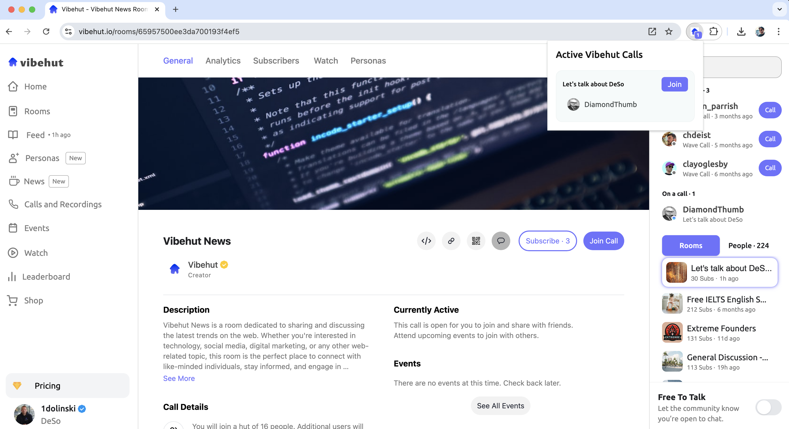

# Vibehut Active Calls Extension

A Chrome extension that shows active calls on Vibehut. Get notified when there are ongoing conversations and join them with a single click.

## What You'll See

When there are active calls, you'll see something like this:

The extension shows:
- 🎯 Active call rooms with their names
- 👥 Current participants in each room
- 🟣 Number badge showing total active calls
- ⚡ Quick "Join" button for each room

## Installation Guide

### Step 1: Download & Extract
1. Download the extension ZIP file
2. Extract/unzip the file to a folder on your computer

### Step 2: Load in Chrome
1. Open Chrome browser
2. Type `chrome://extensions/` in the address bar and press Enter
3. Look for the "Developer mode" toggle in the top-right corner
4. Click to turn ON "Developer mode" (the toggle should slide to the right)

### Step 3: Install Extension
1. Click the "Load unpacked" button that appears in the top-left
2. Navigate to the folder where you extracted the extension files
3. Select the folder (not individual files) and click "Select Folder"
4. The extension should now appear in your Chrome toolbar!

If you don't see the extension icon:
- Click the puzzle piece icon in Chrome toolbar
- Find "Vibehut Active Calls" in the list
- Click the pin icon to keep it visible

## Features

- 🔔 See active Vibehut calls directly from your browser
- 👥 View participants in each call
- 🚀 Join any call with one click
- 💜 Matches Vibehut's clean design
- 🔄 Auto-updates every 20 seconds

## Development

The extension consists of:
- `popup.html/js/css` - UI for the extension popup
- `background.js` - Handles badge updates with active call count
- `content.js` - Content script for Vibehut pages
- `manifest.json` - Extension configuration

## Contributing

Feel free to open issues or submit pull requests if you have suggestions for improvements.

## Credits

Built for [Vibehut](https://vibehut.io) - The place for meaningful conversations.

## License

MIT License - feel free to use and modify as you wish. 